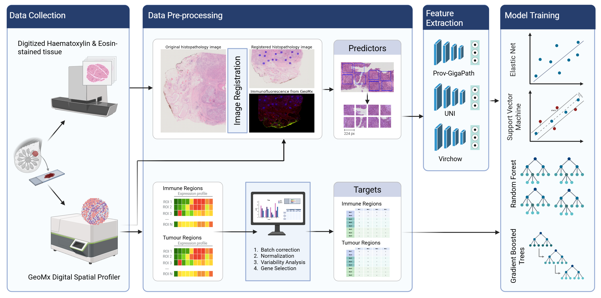
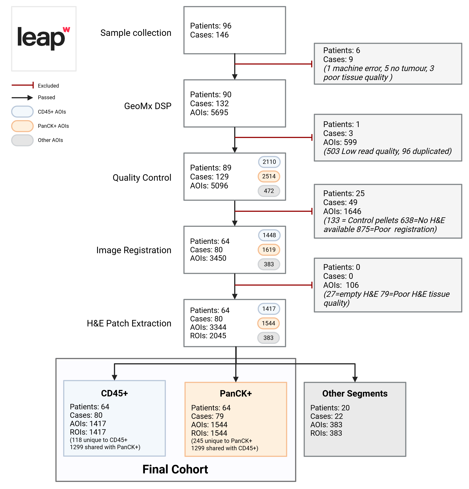
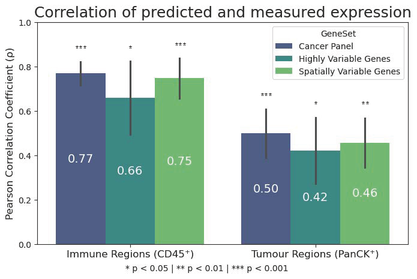
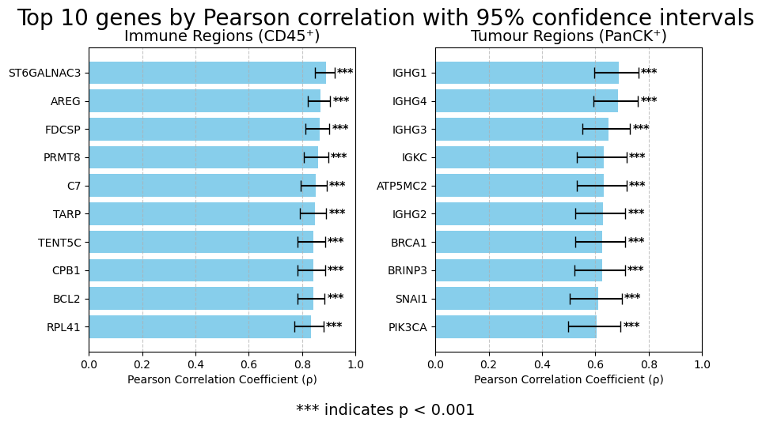
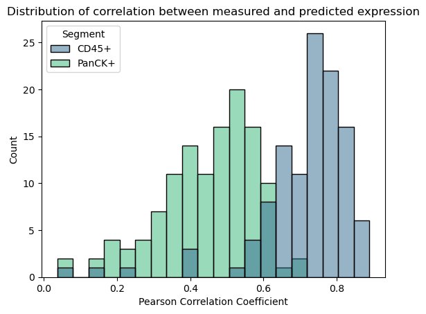
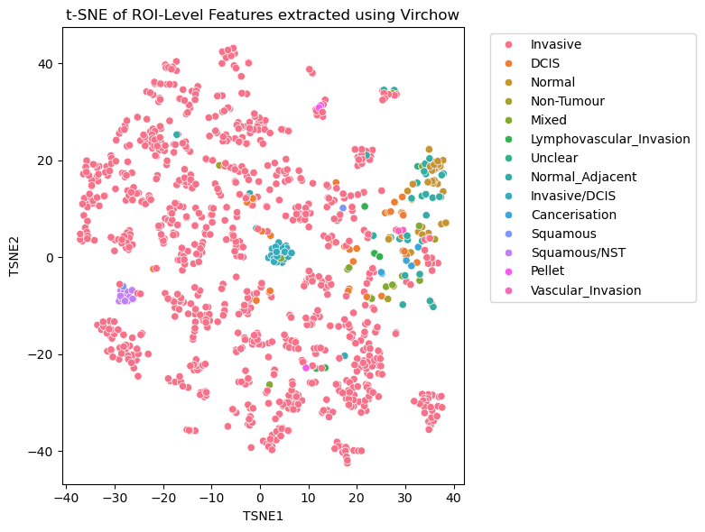

# Predicting Spatial Gene Expression from Histology in Triple-Negative Breast Cancer

This repository accompanies the poster **"Developing a Multi-Modal Framework to Infer Spatial Transcriptomic Profiles from Histology in Triple-Negative Breast Cancer"** by **Holly Rafique**, presented as part of research funded by the NIHR.

---

## Overview

Spatial transcriptomics enables high-resolution mapping of gene expression within the tumour microenvironment, but its clinical use is limited by cost and scalability. This project explores whether **spatial gene expression** can be inferred directly from **H&E-stained tissue images** using:

- **Pathology foundation models** (e.g., Virchow, UNI, Prov-GigaPath) for feature extraction
- **Traditional machine learning** algorithms (e.g., Support Vector Machines) for gene-wise prediction

Focusing on **triple-negative breast cancer (TNBC)**, a highly heterogeneous and aggressive subtype, we demonstrate that spatial gene expression can be recovered with **clinically relevant accuracy** using only routine histology.

---
## Data

We selected a cohort of 64 TNBC patients from the Welcome Leap study.

## Methods Summary

- **Input:** H&E-stained whole slide images (WSIs), spatial transcriptomic data (GeoMx DSP), immune (CD45⁺) and epithelial (PanCK⁺) AOIs.
- **Feature Extraction:** Virchow, UNI, and Prov-GigaPath pathology foundation models.
- **Targets:** Expression values for curated panels, highly variable genes (HVGs), and spatially variable genes (SVGs).
- **Modeling:** One ML model per gene using patient-level 5-fold cross-validation.
- **Evaluation:** Pearson correlation, R², nRMSE, and FDR-adjusted p-values on a held-out test set.

---

## Key Results

- **CD45⁺ regions:**  
  - Panel genes: **PCC = 0.77**  
  - SVGs: **PCC = 0.75**  
  - HVGs: **PCC = 0.66**

- **PanCK⁺ regions:**  
  - Panel genes: **PCC = 0.50**  
  - SVGs: **PCC = 0.46**  
  - HVGs: **PCC = 0.42**

The results demonstrate strong spatial concordance between predicted and measured expression—particularly in immune-rich regions—suggesting the viability of this framework as a cost-effective alternative to spatial transcriptomics.

---

## Acknowledgements

This work was supported by the National Institute for Health and Care Research (NIHR), grant NIHR303406.  
Special thanks to Isobelle Wall, Anthony Baptista, Gregory Verghese and Anita Grigoriadis.

---

## References:

Merritt CR, Ong GT, Church SE, et al. Multiplex digital spatial profiling of proteins and RNA in fixed tissue. Nat Biotechnol. 2020 May;38(5):586-599. doi: 10.1038/s41587-020-0472-9. 

Chen RJ, Ding T, Lu MY, et al.  Towards a general-purpose foundation model for computational pathology. Nat Med. 2024 Mar;30(3):850-862. doi: 10.1038/s41591-024-02857-3.

Vorontsov E, Bozkurt A, Casson A, et al. A foundation model for clinical-grade computational pathology and rare cancers detection. Nat Med. 2024 Oct;30(10):2924-2935. doi: 10.1038/s41591-024-03141-0

Xu H, Usuyama N, Bagga J, et al. A whole-slide foundation model for digital pathology from real-world data. Nature. 2024;630(8015):181–188. doi:10.1038/s41586-024-07441-w

Wang C, Chan AS, Fu X,et al. Benchmarking the translational potential of spatial gene expression prediction from histology. Nat Commun. 2025 Feb 11;16(1):1544. doi: 10.1038/s41467-025-56618-y.

## Supplementary Images:

---

## Contact

For questions or collaboration opportunities, contact:  
📧 **holly.rafique@kcl.ac.uk**

